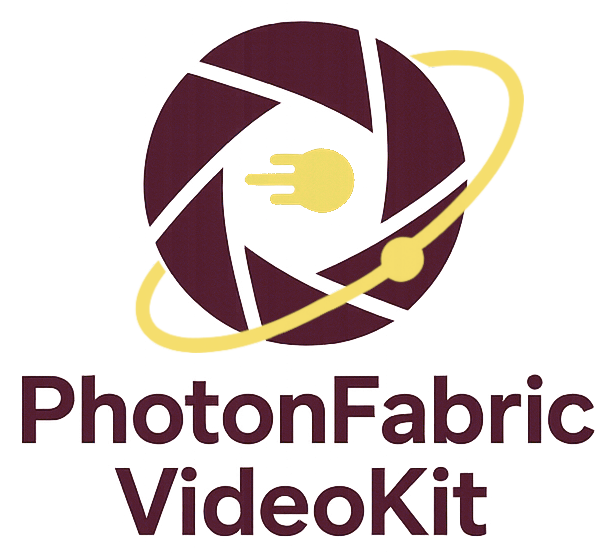

# PhotonFrame – VideoKit



A modular, ffmpeg-driven video toolkit with optional AI models – designed for **interactive use on the command line** _and_ for fully automated batch workflows.
PhotonFrame VideoKit wraps common video tasks into focused subcommands:

- converting & compressing
- trimming, scaling, cropping/padding
- merging clips, audio and subtitles
- metadata inspection & editing
- GIF / meme generation
- image-sequence → video
- frame interpolation
- classic filter enhancement
- **AI upscaling & enhancement** (Real-ESRGAN / RealCUGAN, etc.)
- stream extraction (audio, frames, subtitles, thumbnails)

Designed for curating and enriching large video collections: normalize formats, batch-fix quality, add or repair metadata, and bulk-generate thumbnails or gifs in one place. Everything can be run interactively for quick tasks or in batch mode to process many files unattended.

All subcommands follow the same philosophy:

- **Interactive mode** (no file arguments): guided wizard, safe defaults, explanations.
- **CLI/batch mode** (with files & flags): fully scriptable, stable interface.
- Wherever possible, **streams, chapters, thumbnails, alpha & metadata** are preserved or sensibly re-created.

---

## 1. Overview

PhotonFrame – VideoKit is a **modular toolbox built around ffmpeg** (and optional AI models) that breaks typical video workflows into separate commands:

- `convert` – container/codec conversion with presets
- `compress` – simple “quality in %” interface for filesize reduction
- `trim` – fast or frame-accurate cutting
- `scale` – classic resolution scaling
- `croppad` – axis-wise crop or pad to a target resolution
- `merge` – concatenate clips + add audio/subtitle tracks
- `interpolate` – increase or normalize FPS (frame interpolation)
- `img2vid` – turn image sequences into videos
- `extract` – audio, subtitles, frames, video streams, thumbnails
- `enhance` – classic filter enhancement (stabilize, denoise, color)
- `aienhance` – AI upscaling/enhancement with Real-ESRGAN / RealCUGAN
- `gif` – animated GIF & meme creation
- `metadata` – detailed metadata inspection & editing

Every command lives in its own module and has a dedicated infofile under `infofiles/PhotonFrame.<subcommand>.en.info` called by `video <COMMAND> --help/-h`.

---

## 2. Requirements

- **OS**: Linux (primary), macOS (VideoToolbox), Windows via **WSL2 + Ubuntu** (native Windows console not supported).
- **Runtime**: Python 3.10.x
- **Core tools**:
  - `ffmpeg` and `ffprobe` (required)
- **Terminal (recommended)**:
  - A modern terminal emulator that can display images (for inline previews and thumbnails), e.g. **kitty** or similar. On macOS, iTerm2/kitty work well; on Windows use Windows Terminal inside WSL2.
- **Optional for AI features**:
  - CUDA-capable GPU (for PyTorch backends) or Apple Silicon/MPS on macOS
  - AI models (Real-ESRGAN / RealCUGAN, etc.) – handled by the project’s installer / model manager.

See the repository’s `install.sh` for the exact, up-to-date dependencies and model setup.

---

## 3. Installation

> The exact commands may differ depending on how you structure the repo; adapt names to your layout.

### 3.1 Clone the repository

```bash
git clone https://github.com/DavidDirnberger/PhotonFrame-VideoKit.git
cd PhotonFrame-VideoKit
```

### 3.2 Using the installer (recommended)

```bash
chmod +x install.sh
./install.sh
```

The installer will:

- create an isolated Conda environment (PhotonFrameVideoKit)
- install the required Python packages (with offline caches where possible)
- check/install ffmpeg and ffprobe (via Conda or system packages)
- optionally install ExifTool for robust metadata handling
- detect OS and GPU to choose a suitable AI backend (PyTorch / NCNN, CUDA / MPS / CPU)
- download and prepare AI models for aienhance (Real-ESRGAN / RealCUGAN, optional face restoration models)
- optionally install CodeFormer (face restoration, non-commercial S-Lab License 1.0)
- write a user config (config.ini) under your platform’s config directory
- create a video launcher in ~/.local/bin pointing to the installed toolkit

> The installer is designed to be robust on unstable connections
> (resumable downloads, many retries, fallbacks, offline caches).

### 3.3 Platform notes

- **macOS**: Supported. Use Homebrew for `ffmpeg` (VideoToolbox hardware encoders are included in Homebrew builds) and `aria2`/`chafa`/`xdg-utils` if desired. The installer detects macOS, uses the macOS Miniconda installer, and will pick MPS for AI if available. Terminal previews work in iTerm2/kitty; VideoToolbox hardware encoders are exposed as `*_videotoolbox`.
- **Windows (via WSL2)**: Recommended path. Install WSL2 + Ubuntu, ensure Windows Terminal is set to use WSL, then run `./install.sh` inside WSL. GPU acceleration in WSL requires recent drivers (for CUDA) and `wsl --update`. Native PowerShell/CMD is not supported by the Bash installer.

### 3.4 macOS step-by-step

```bash
# 1) Homebrew + tools
/bin/bash -c "$(curl -fsSL https://raw.githubusercontent.com/Homebrew/install/HEAD/install.sh)"
brew install git ffmpeg aria2 chafa xdg-utils

# 2) Clone the project
git clone https://github.com/DavidDirnberger/PhotonFrame-VideoKit.git
cd PhotonFrame-VideoKit

# 3) Run the installer (prompts for language, AI features, install path)
chmod +x install.sh
./install.sh

# 4) After install, the launcher is ready:
video -h
```

- Hardware encoders: VideoToolbox is included in Homebrew ffmpeg (`*_videotoolbox`).
- AI: On Apple Silicon, AI will use MPS automatically if available.
- Terminal preview: iTerm2 or kitty recommended.

### 3.5 Windows via WSL2 step-by-step

```powershell
# 1) Install WSL2 + Ubuntu (PowerShell as admin)
wsl --install -d Ubuntu
wsl --update

# 2) Switch Windows Terminal to WSL profile, then inside Ubuntu shell:
sudo apt update && sudo apt install -y git
git clone https://github.com/DavidDirnberger/PhotonFrame-VideoKit.git
cd PhotonFrame-VideoKit

# 3) Run the installer
chmod +x install.sh
./install.sh

# 4) Launcher in WSL:
video -h
```

- GPU in WSL: For CUDA you need recent NVIDIA drivers + `wsl --update`; MPS is not available.
- Terminal preview: Windows Terminal renders chafa output correctly; inline image preview works as on Linux.

### 4. Basic Usage

All commands share the same pattern:

```bash
video <COMMAND> [FILES] [OPTIONS]
```

**Interactive mode:**
Call without FILES and OPTIONS:

- a guided wizard starts
- you are guided through format, codec, preset, resolution, etc.
- safe defaults, warnings and hints are shown

**CLI / batch mode:**
Provide one or more files and the relevant flags:

- ideal for scripts, cron jobs, large batch processing
- stable flag semantics as shown in video \<COMMAND> --help/-h

**Examples:**

```bash
# Interactive conversion wizard
video convert

# Direct conversion, CLI-style
video convert input.mkv --format mp4 --codec h264 --preset web

# Batch pattern: file%.mkv → file001.mkv, file6.mkv, file030.mkv, …
video compress season1_ep%.mkv --quality 40
```

### 5. Global Behaviour & Concepts

## 5.1 Streams, metadata & thumbnails

Across commands, PhotonFrame tries to:

- preserve video, audio and subtitle streams where no re-encode is needed (-c copy when possible)
- preserve or re-embed cover / thumbnail images
- keep or reconstruct metadata and chapters, depending on container/codec support
- use a plan-based stream mapping API to:
  - detect stream types and codecs
  - map them according to container constraints
  - apply fallback strategies (e.g. subtitle re-muxing for MP4/MOV)

## 5.2 Alpha & pixel format

The toolkit is alpha-aware:

- detects alpha channels in source material
- warns if the chosen container+codec cannot store alpha
  (e.g. MP4 + h264, many hardware-accelerated pipelines)
- suggests alpha-capable alternatives, such as:
  - `MKV + FFV1`, `MKV + ProRes 4444`, `MKV + PNG`, `MKV + QTRLE`
  - WebM/Matroska with AV1/VP9 alpha
  - `AVI/MKV + UtVideo`, `Magicyuv`, `rawvideo`, …

Pixel formats are treated as follows:

- mappings per codec & container
- alignment and subsampling constraints (even width/height where required)
- automatic correction of odd dimensions while preserving visible content
- HDR-related flags (color primaries, transfer characteristics, matrix) are preserved where possible

## 5.3 Placeholders & batch patterns

All commands share the same placeholder semantics:

- `%` in the filename stands for a numeric index
- `file%.mkv` will match or generate:
  - `file001.mkv`, `file6.mkv`, `file030.mkv`, …

This is used consistently across the toolkit:

- `convert`, `compress`, `trim`, `scale`, `croppad`, `merge`, `interpolate`, `img2vid`, `extract`, `metadata`, …

## 5.4 Return codes

- `0` → success
- non-zero → ffmpeg / environment error, typical cases:
  - invalid or unsupported flags
  - missing codecs / encoders
  - failed I/O or permission errors
  - model / backend not available

This makes PhotonFrame easy to integrate into shell scripts, batch jobs and CI pipelines.

### 6. Commands in Detail

## 6.1 convert – general container/codec conversion

Infofile: `video convert --help/-h`

Converts video files using `ffmpeg`. Supports both interactive and CLI mode:

- choose target container: `mp4`, `mkv`, `avi`, `mov`, `webm`, `mpeg`
- choose video codec:
  `h264`, `hevc`, `av1`, `vp9`, `vp8`, `mpeg4`, `prores`, `dnxhd`,
  `jpeg2000`, `mjpeg`, `ffv1`, `huffyuv`, `utvideo`,
  `theora`, `qtrle`, `hap`, `rawvideo`, `png`, `magicyuv`,
  `cineform`, `mpeg1video`, `mpeg2video`
- presets: `messenger360p`, `messenger720p`, `web`, `casual`, `cinema`, `studio`, `ultra`, `lossless`
- optional resolution & framerate changes
- preserves or re-embeds thumbnails, metadata and compatible streams

**Example:**

```bash
# Web-friendly MP4, AV1 codec, “web” preset
video convert movie.mkv --format mp4 --codec av1 --preset web
```

---

## 6.2 compress – filesize reduction by percentage

Infofile: `video compress --help/-h`

Compresses videos via a simple visual quality percentage:

- `--quality` (0–100) maps internally to CRF
- higher values → better quality, larger files
- lower values → stronger compression, smaller files
- container/codec are chosen to stay close to the original (or a robust default)
- thumbnails, metadata and stream layout are preserved whenever possible

**Example:**

```bash
# Compress a season to about 40% visual quality
video compress season1_ep%.mkv --quality 40
```

---

## 6.3 trim – cutting & segment extraction

Infofile: `video trim --help/-h`

Two modes:

- Fast (lossless / GOP-based)
  - copies video/audio/subtitles
  - cuts only on keyframes → not perfectly frame-accurate

- Precise (re-encode)
  - frame-accurate
  - uses the same quality presets as `convert` (`messenger360p` … `lossless`)

Supported time formats:

- SS(.fff), MM:SS, HH:MM:SS(.fff)
- percentages: 10%, 10p
- negative offsets: -1:20 (relative from end)

**Examples:**

```bash
# Simple lossless trim: 30s to 50s
video trim film.mp4 --start 0:30 --duration 20

# Precise trim with “cinema” quality
video trim input.mkv --start 01:00:00 --end 01:05:30 --precise --quality cinema

# Batch trim using patterns
video trim clip%.mp4 --start 10 --duration 30%
```

Thumbnails and metadata are preserved and re-embedded where possible.

---

## 6.4 scale – resolution scaling

Infofile: `video scale --help/-h`

Scales videos to preset or custom resolutions:

- presets: `240p`, `360p`, `480p`, `720p`, `1080p`, `1440p`, `QHD+`, `4K`, `4K-DCI`, `8K`, `8K-DCI`
- `original` keeps source resolution but fixes odd dimensions for encoder alignment
- custom resolution with flexible separators: `W:H`, `W×H`, `W H`, …

Aspect ratio:

- `--preserve-ar true` (default): bounding-box behavior
- `--preserve-ar false`: stretch to exactly the target

**Examples:**

```bash
# Scale to 1080p, preserving AR
video scale clip.mp4 --resolution 1080p

# Batch downscale
video scale film%.mkv --resolution 720p

# Custom target without AR preservation
video scale sample.mov --resolution 320x240 --preserve-ar false
```

---

## 6.5 croppad – axis-wise crop/pad

Infofile: `video croppad --help/-h`

Crop or pad independently per axis:

- choose target `--resolution` (same presets/custom syntax as `scale`)
- use `--offset` / `--offset-x` / `--offset-y` to control the crop origin
- for sources with alpha, transparent padding is used
- `original` may be used when you only want to touch metadata/thumbnail

**Examples:**

```bash
# Center-crop/pad to 1920x1080
video croppad input.mkv --resolution 1920x1080

# Crop starting from a specific offset
video croppad input.mkv --resolution 1920x800 --offset 0:100
```

---

## 6.6 merge – concatenate & add streams

Infofile: `video merge --help/-h`

Combines:

- multiple video clips
- optional additional audio/subtitle files

Key options:

- `--target-res` strategy:
  `match-first`, `no-scale`, `smallest`, `average`, `largest`, `fixed:WxH`
- `--offset`, `--pause` between clips
- `--audio-offset`, `--subtitle-offset`
- `--extend` to length of the longest external track
- standard `--format`, `--codec`, `--preset`, `--output`

Streams & metadata:

- main video streams, metadata, chapters and thumbnails are preserved where possible
- additional subtitles converted as needed (e.g. to `mov_text` for MP4/MOV)
- language/title heuristics from filenames and ISO-639-2 codes

**Examples:**

```bash
# Seamless join with small pause
video merge a.mp4 b.mp4 \
  --target-res match-first \
  --pause 1.0s \
  --format mkv --codec h264 --preset casual

# Concatenate MOVs without scaling, using ProRes
video merge part1.mov part2.mov part3.mov \
  --target-res no-scale \
  --format mov --codec prores --preset studio

# Video + audio + subtitles with offsets
video merge movie.mkv dub_de.aac subs_en.srt \
  --audio-offset 1.5s --subtitle-offset 2s \
  --format mkv
```

---

## 6.7 interpolate – frame-rate upsampling

Infofile: `video interpolate --help/-h`

Raises or normalizes FPS using ffmpeg’s minterpolate:

- `--factor` accepts:
  - multiplicative factors: `2x`, `1.5x`, …
  - absolute FPS: `60`, `59.94`, `30000/1001`, …

- `--quality:`
  - `std` – balanced
  - `hq` – mild pre-denoise
  - `max` – stronger pre-denoise + sharpening

**Examples:**

```bash
# 25 → 50 FPS
video interpolate film.mkv --factor 2x

# Normalize to ~59.94 FPS using rational notation
video interpolate clip.mp4 --factor 60000/1001 --quality hq
```

---

## 6.8 img2vid – image sequence → video

Infofile: `video img2vid --help/-h`

Creates videos from:

- numbered image sequences (`frame_0001.png`, `frame_0002.png`, …)
- folders containing images

Options:

- presets: `messenger360p`, `messenger720p`, `web`, `casual`, `cinema`, `studio`, `ultra`, `lossless`
- `--format`, `--codec` (reusing convert’s logic)
- `--framerate` or `--duration` for total video length
- optional `--scale`

**Example:**

```bash
# Simple slideshow, web preset
video img2vid frames/frame_%.png \
  --preset web --framerate 30 --format mp4
```

---

## 6.9 extract – audio / subtitle / frame / video extraction

Infofile: `video extract --help/-h`

Selective extraction:

- `--audio` → extract all audio tracks (e.g. as MP3 or original codec)
- `--subtitle` / `--format` → extract subtitles (with optional language filters)
- `--frame` / `--format` → extract a single still image at:
  - seconds: `10`, `10s`
  - `MM:SS`, `HH:MM:SS(.ms)`
  - percentage: `50%`
  - special positions: `middle`, `mid`, `center`
- `--video` → raw video streams / package formats

**Examples:**

```bash
# Single representative frame at 50%
video extract movie.mkv --frame 50%

# All audio tracks
video extract concert.mkv --audio

# All audio + English subtitles from multiple files
video extract film%.mkv --audio --subtitle en
```

---

## 6.10 enhance – classic filter enhancement

Infofile: `video enhance --help/-h`

Filter-based enhancement using ffmpeg:

- presets combine stabilization, denoise and color tweaks:
  - `soft`, `realistic`, `max`, `color_levels`, `cinematic`, `hist_eq`, `vibrance`, `stabilize_only`, `denoise_only`

- individual controls:
  - stabilization toggles & strength (`--stabilize`, `--stab-method`, …)
  - denoise filters
  - brightness/contrast/saturation percentages

**Example:**

```bash
# Light “realistic” enhancement
video enhance vacation.mp4 --preset realistic

# Custom color tweak
video enhance clip.mkv --brightness 10 --contrast 5 --saturation 15
```

---

## 6.11 aienhance / ai-enhance – AI upscaling & enhancement

Infofile: `video aienhance --help/-h`

AI-based scaling / enhancement using Real-ESRGAN and RealCUGAN:

- `--aimodel`:
  - `realesr-general-x4v3` (general-purpose 4×)
  - `RealESRGAN_x4plus`, `RealESRGAN_x2plus`
  - `RealESRGAN_x4plus_anime_6B`
  - RealCUGAN variants (via NCNN backend)
- `--scale`:
  - factor (e.g. `2.0`, `4.0`) – allowed range depends on model
- denoise / noise level flags (model-dependent)
- optional TTA (`--tta`) for better quality (slower)
- blending:
  - `--blend`, `--blend-opacity` to mix original and AI output
- VRAM-aware chunking, tile strategies and retry mechanisms

The command remuxes streams, metadata, chapters and thumbnails back into the final container whenever possible.

**Example:**

```bash
# 1080p → ~4K using a general AI model
video aienhance ep%.mkv \
  --aimodel realesr-general-x4v3 \
  --scale 2 \
  --priority medium
```

---

## 6.12 gif – GIF & meme creation

Infofile: `video gif --help/-h`

Creates animated GIFs from:

- video clips
- existing GIFs

Key features:

- meme text:
  - `--text-top`, `--text-bottom`

- font size:
  - presets: `thiny`, `small`, `medium`, `grande`, `large`, `huge`
  - or explicit pixel sizes (min 8 px)
  - separate flags like `--font-size-top`, `--font-size-bottom` (if enabled)
- quality control:
  - optional high-quality pipeline (less aggressive palette reduction)
- `--no-auto-open` to suppress automatic viewer launch

**Example:**

```bash
video gif clip.mp4 \
  --text-top "WHEN CODE WORKS" \
  --text-bottom "AND YOU DON’T KNOW WHY" \
  --font-size medium
```

---

## 6.13 metadata – inspect & edit metadata

Infofile: `video metadata --help/-h`

Reads and writes container/stream metadata with a strong safety layer:

- `--list-tags`:
  - formatted overview (technical info + grouped tags)
- `--list-tags-json`:
  - structured JSON for scripts
- `--list-tagnames`:
  - full schema of known metadata keys:
    - editable, protected, virtual read-only
Generic tag interface:
- `--tag title` → print title
- `--tag title="My Movie"` → set title
- multiple `--tag` options allowed
Tag-specific convenience flags:
- `--title`, `--artist`, `--genre`, `--production_year`, …
- `--set-tag-KEY`, `--delete-tag-KEY`, `--list-tag-KEY`
Thumbnail control:
- `--set-thumbnail IMAGE`
- `--delete-thumbnail`
- `--show-thumbnail`
Interactive mode:
- shows technical video info (resolution, FPS, pixfmt, color primaries, alpha, streams, chapters)
- groups metadata into protected / editable / other
- allows interactive edit/delete of editable tags
- supports interactive thumbnail set/remove (if container supports it)
Writes are performed in-place via a dedicated `metadata_support` layer, with:
- AVI quirks handled (optionally via exiftool)
- post-write verification of the requested tag changes

**Examples:**

```bash
# Interactive view
video metadata film.mkv

# Tag schema
video metadata --list-tagnames

# Compact overview for multiple episodes
video metadata season1_ep%.mkv --list-tags

# Read specific tags
video metadata film.mkv --tag title --tag production_year

# Set tags in batch
video metadata ep%.mkv --title "My Series" --production_year 2024

# Delete tags
video metadata film.mkv --delete-tag-comment --delete-tag-keywords
```

---

## 7. Contributing

Contributions are very welcome – whether it's bug reports, ideas for improvements, or pull requests with code changes.

### Reporting issues

If you run into problems, please open an issue on GitHub and include as much context as possible:

- Your OS and PhotonFrame - VideoKit version
- The exact command you ran (e.g. `video convert ...`)
- A short description of what you expected vs. what actually happened
- Relevant console output or error messages

To make debugging easier, you can also attach **log files from the `logs/` folder in the project directory** (for example the most recent `logs/*.log` file).
These logs contain detailed information about what happened internally and are very helpful for analysis.

> Before sharing logs, please quickly scan them and remove anything you consider private (usernames, paths, filenames, etc.).

## 8. License

PhotonFrame – VideoKit is licensed under the [MIT License](./LICENSE).

Some optional components and dependencies are downloaded from their original
repositories and remain under their respective licenses, including but not
limited to:

- Real-ESRGAN (BSD 3-Clause)
- Real-CUGAN (MIT, by bilibili)
- BasicSR, GFPGAN (Apache-2.0)
- facexlib (MIT)
- CodeFormer (S-Lab Non-Commercial License 1.0 – **non-commercial use only**)
- Microsoft Core Fonts – Impact (proprietary, Microsoft Core Fonts EULA)

Models are not shipped with this repository. They are downloaded from their official sources, which are subject to their own licenses.
See `THIRD_PARTY_LICENSES.md` for an overview and the upstream projects.
See the LICENSE file in this repository for licensing terms.
